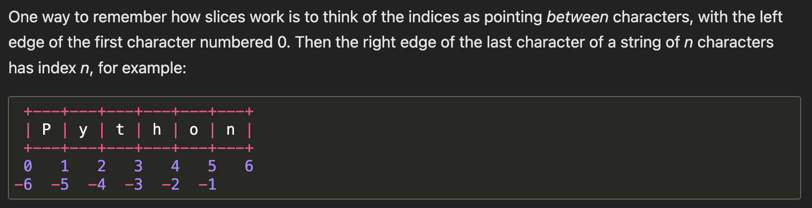

# Strings in Java

Strings can be concatenated (glued together) with the + operator, and repeated with *

```python
3 * 'un' + 'ium' # 3 times 'un', followed by 'ium'
>'unununium'
```

Two or more string literals (i.e. the ones enclosed between quotes) next to each other are automatically concatenated.
```python
'Py' 'thon'
>Python
``` 

>[!NOTE]
To quote a quote, we need to “escape” it, by preceding it with \\. Alternatively, we can use the other type of quotation marks:

```python
'doesn\'t'  # use \' to escape the single quote...
>"doesn't"
"doesn't"  # or use double quotes instead
>"doesn't"
```

## Formatted Strings ( f-string )
An f-string is a string literal that is prefixed with f or F. This type of string literal allows embedding arbitrary Python expressions within replacement fields, which are delimited by curly brackets ({}). These expressions are evaluated at runtime, similarly to str.format(), and are converted into regular str objects. For example

```python
name = 'Manan'
print(f'Hello {name}')
>Hello Manan
```

To include a literal { or }, use a double bracket
```python
x = 42
print(f'{{x}} is {x}')
>{x} is 42
```

**Any non-string expression is converted using str(), by default.**


### printf-style String Formatting ( Like Java, C )

Given format % values (where format is a string), % conversion specifications in format are replaced with zero or more elements of values. For example

```python
print('%s has %d quote types.' % ('Python', 2))
```

If format requires a single argument, values may be a single non-tuple object. Otherwise, values must be a tuple with exactly the number of items specified by the format string, or a single mapping object (for example, a dictionary).

When the right argument is a dictionary (or other mapping type), then the formats in the string must include a parenthesised mapping key into that dictionary inserted immediately after the '%' character. The mapping key selects the value to be formatted from the mapping. For example:

```python
print('%(language)s has %(number)f quote types.' %
      {'language': "Python", "number": 2})
>Python has 2.0 quote types.
```


## Indexing Strings

Strings can be indexed (subscripted), with the first character having index 0. There is no separate character type; a character is simply a string of size one.

```python
word = 'Python'
word[0]  # character in position 0
>'P'
word[5]  # character in position 5
>'n'
```

Indices may also be negative numbers, to start counting from the right. **Note that since -0 is the same as 0, negative indices start from -1**

```python
word[-1]  # last character
>'n'
word[-2]  # second-last character
>'o'
word[-6]
>'P'
```

## Slicing Strings

While indexing is used to obtain individual characters, slicing strings allows you to obtain a substring

```python
word[0:2]  # characters from position 0 (included) to 2 (excluded)
>'Py'
word[2:5]  # characters from position 2 (included) to 5 (excluded)
>'tho'
```

>[!IMPORTANT]
**Slice indices have useful defaults; an omitted first index defaults to zero, an omitted second index defaults to the size of the string being sliced.**

```python
word[:2]   # character from the beginning to position 2 (excluded)
>'Py'
word[4:]   # characters from position 4 (included) to the end
>'on'
word[-2:]  # characters from the second-last (included) to the end
>'on'
word[:-2] # characters from the beginning to second last (excluded)
```

>[!NOTE]
**The start is always included, and the end always excluded. This makes sure that s[:i] + s[i:] is always equal to s**

```python
word[:2] + word[2:]
>'Python'
word[:4] + word[4:]
>'Python'
```



>[!NOTE]
**For non-negative indices, the length of a slice is the difference of the indices, if both are within bounds. For example, the length of word[1:3] is 2.**

Python strings cannot be changed — they are **immutable**. Therefore, assigning to an indexed position in the string results in an error.

```python
word[0] = 'J'
>Traceback (most recent call last):
  File "<stdin>", line 1, in <module>
TypeError: 'str' object does not support item assignment
```

## Escape Characters in Strings

```python
'\'' # Single Quote
> '

'\\' # Backslash
> \

'Test\nTest2' # Newline
>Test
Test2

'Test\tTest2' # Tab
>Test   Test2

'Helloo\bWorld' # Backspace
>HelloWorld

```

>[!NOTE]
In the Python shell, the string definition and output string can look different. The print() function produces a more readable output, by omitting the enclosing quotes and by printing escaped and special characters:

```python
s = 'First line.\nSecond line.'
s  # without print(), special characters are included in the string
>'First line.\nSecond line.'
print(s)  # with print(), special characters are interpreted, so \n produces new line
>First line.
Second line.
```

### Raw Strings
If you don’t want characters prefaced by \ to be interpreted as special characters, you can use raw strings by adding an r before the first quote

```python
print('C:\some\name')  # here \n means newline!
>C:\some
ame
print(r'C:\some\name')  # note the r before the quote
>C:\some\name
```

## String Methods

1. **str.capitalize()** - Return a copy of the string with its first character capitalized and the rest lowercased. 

2. **str.title()** - Return a titlecased version of the string where words start with an uppercase character and the remaining characters are lowercase.

```python
'Hello world'.title()
>'Hello World'
```

The algorithm uses a simple language-independent definition of a word as groups of consecutive letters. The definition works in many contexts but it means that apostrophes in contractions and possessives form word boundaries, which may not be the desired result.

```python
"they're bill's friends from the UK".title()
>"They'Re Bill'S Friends From The Uk"
```

3. **str.count(sub, start, end)** - Return the number of non-overlapping occurrences of substring sub in the range [start, end]. Optional arguments start and end are interpreted as in slice notation

```python
'spam, spam, spam'.count('spam')
>3
'spam, spam, spam'.count('spam', 5)
>2
'spam, spam, spam'.count('spam', 5, 10)
>1
'spam, spam, spam'.count('eggs')
>0
'spam, spam, spam'.count('')
>17
```

3. **str.find(sub, start, end)** - Return the lowest index in the string where substring sub is found within the slice s[start:end]. Optional arguments start and end are interpreted as in slice notation. Return -1 if sub is not found.

4. **str.lower()** - Return a copy of the string with all the cased characters converted to lowercase.

5. **str.upper()** - Return a copy of the string with all the cased characters converted to uppercase.

6. **str.partition(sep)** - Split the string at the first occurrence of sep, and return a 3-tuple containing the part before the separator, the separator itself, and the part after the separator. If the separator is not found, return a 3-tuple containing the string itself, followed by two empty strings.
   
7. **str.replace(old, new, count=-1)** - Return a copy of the string with all occurrences of substring old replaced by new. If count is given, only the first count occurrences are replaced. If count is not specified or -1, then all occurrences are replaced.
   
8. **str.split(sep=None, maxsplit=-1)** - Return a list of the words in the string, using sep as the delimiter string. If maxsplit is given, at most maxsplit splits are done (thus, the list will have at most maxsplit+1 elements). If maxsplit is not specified or -1, then there is no limit on the number of splits (all possible splits are made).

If sep is given, consecutive delimiters are not grouped together and are deemed to delimit empty strings (for example, '1,,2'.split(',') returns ['1', '', '2']). The sep argument may consist of multiple characters as a single delimiter (to split with multiple delimiters, use re.split()). Splitting an empty string with a specified separator returns [''].

```python
'1,2,3'.split(',')
>['1', '2', '3']
'1,2,3'.split(',', maxsplit=1)
>['1', '2,3']
'1,2,,3,'.split(',')
>['1', '2', '', '3', '']
'1<>2<>3<4'.split('<>')
>['1', '2', '3<4']
```

9.  **str.center(width, fillchar)** - Return centered in a string of length width. Padding is done using the specified fillchar (default is an ASCII space). The original string is returned if width is less than or equal to len(s).

```python
'Python'.center(10)
>'  Python  '
'Python'.center(10, '-')
>'--Python--'
'Python'.center(4)
>'Python'
```


## References

[Pythons Docs Strings](https://docs.python.org/3/tutorial/introduction.html#using-python-as-a-calculator)

[Pythons Docs Strings Methods](https://docs.python.org/3/library/stdtypes.html#string-methods)
