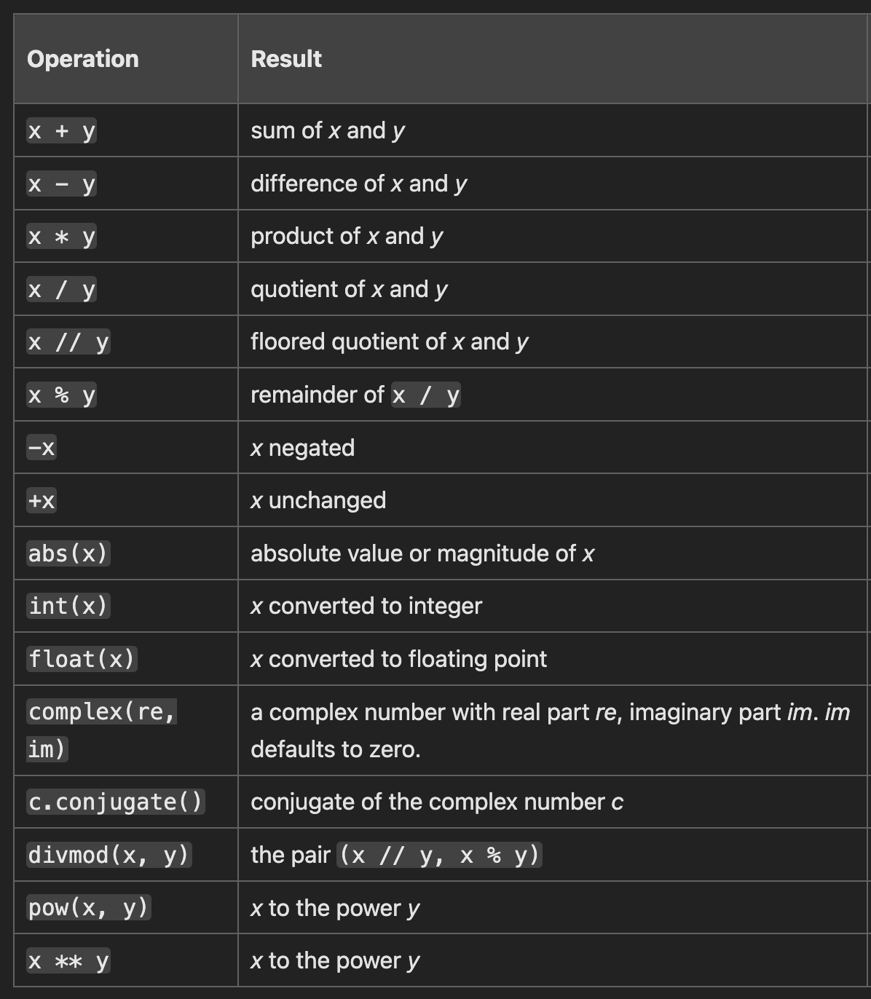

# Variables and Datatypes in Python

Variables can be defined as: **\<name> = \<value>**
```python
a = 10 # int
b = "Manan" # String
c = True # Booleans
d = 3.2 # Float 
```

## Arithmetic Operations
```python
2 + 2 
>4

50 - 5*6
>20

(50 - 5*6) / 4
>5.0

8 / 5  # division always returns a floating-point number
>1.6

5 ** 2 # 5 to the power 2
>25
```

>[!NOTE]
**Division (/) always returns a float.  
To do floor division and get an integer result you can use the // operator.  
To calculate the remainder you can use %.  
To Calculate Powers use \*\***



## Strings

```python
'spam eggs'  # single quotes

"Paris rabbit got your back :)! Yay!"  # double quotes

'1975'  # digits and numerals enclosed in quotes are also strings
```

### [More about Strings](strings.md)

## Type Conversions

```python
print('Python' + 3) # Result in an Error because a str and int cannot be operated

print('Python' + str(3)) # Converts 3 to string '3'
>Python3

print(int('5') + 10) # Converts '5' to 5
>10
```

